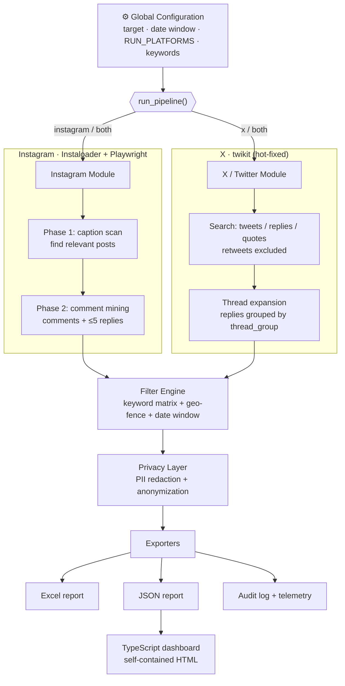
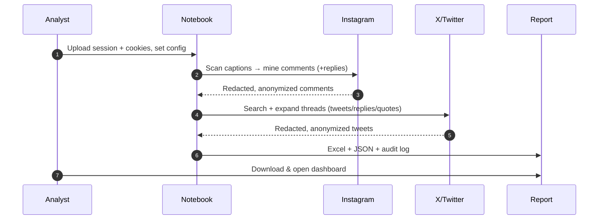

<div align="center">

# 🎓 PCMB & SPMB Jabar (West Java) 2026 Social Intelligence Pipeline

### Public sentiment & anomaly monitoring for the West Java 2026 student-admission period

*Mine public conversations from **Instagram** & **X (Twitter)**, filter them down to genuine SPMB/PCMB Jabar signal, and deliver a clean, **PII-redacted & anonymized** report; plus an interactive dashboard.*

<br/>

<!-- ─────────────  BADGES (rendered "buttons")  ───────────── -->


-twikit-000000?style=for-the-badge&logo=x&logoColor=white)


<br/>

<!-- ─────────────  "OPEN IN COLAB" BUTTON  ─────────────
     Replace USER/REPO below with your GitHub path once pushed. -->
[](https://colab.research.google.com/github/USER/REPO/blob/main/PCMB_Jabar_2026_Social_Intelligence_Pipeline.ipynb)

</div>

---

<!-- ─────────────  DEMO / SCREENSHOT  ─────────────
     Drop a screen-recording or dashboard screenshot into docs/ and uncomment:
     <div align="center"></div>
-->

> 🇬🇧 English · 🇮🇩 Bahasa Indonesia | the notebook ships **bilingual** in-app guidance for every step.

## 📑 Table of Contents

- [Features](#features) 
- [Architecture](#architecture)
- [Pipeline flow](#pipeline-flow)
- [Quick Start](#quick-start)
- [Output](#output)
- [Dashboard](#dashboard)
- [Privacy & Compliance](#privacy--compliance)
- [Project Structure](#project-structure)
- [Tech Stack](#tech-stack)
- [Troubleshooting](#troubleshooting)
- [Disclaimer](#disclaimer)

---

## Features

| | Feature | Details |
|:-:|---|---|
| 1. | **Instagram (Instaloader)** | Public comments **+ up to 5 replies each** on `@disdikjabar` posts. Two-phase: fast caption scan → deep comment mining. |
| 2. | **X / Twitter (twikit)** | **Tweets, replies & quote tweets** about SPMB/PCMB Jabar. Retweets excluded. Optional thread expansion groups replies under a shared `thread_group`. |
| 3. | **Precision filtering** | DNF keyword matrix **+ mandatory West-Java geo-fence** kills national-program false positives. |
| 4. | **Content-safe** | No raw external text ever written to logs; spam / adult / off-topic noise filtered out. |
| 5. | **Privacy by design** | Regex PII redaction **+** per-platform username anonymization **before** anything hits disk. |
| 6. | **Platform switch** | `RUN_PLATFORMS = "both" \| "instagram" \| "x"` or `run_pipeline("x")`. |
| 7. | **Rich output** | Multi-sheet **Excel** + structured **JSON** + full **audit log** with per-decision telemetry. |
| 8. | **Dashboard** | Zero-dependency **TypeScript** tool renders a self-contained interactive HTML report. |
| 9. | **Colab-ready** | Runs end-to-end in Google Colab; resilient hot-fixes for upstream library drift. |
| 10. | **100% free tooling** | No paid APIs or proxies. |

---

## Architecture



---

## Pipeline flow



---

## Quick Start

### Option A — Google Colab (recommended)

1. **Prepare auth once, on your home connection** (never from Colab's data-center IP):
   ```bash
   # Instagram session
   pip install instaloader
   instaloader --login=YOUR_BOT_ACCOUNT
   ```
   For X, run the *“Recommended: pre-authenticate X”* cell to create `x_cookies.json`.
   > Use a **secondary / bot account** for both — never a primary account.
2. Open the notebook in Colab (badge above) and **Run all**.
3. Upload `session-YOUR_BOT_ACCOUNT` and `x_cookies.json` into `/content/`.
4. Fill in the **Global Configuration** cell, then run **Main Orchestration**.
5. Download the `.xlsx`, `.json`, and `pipeline_audit_log.txt` from `/content/`.

### Option B — Local

```bash
pip install -q --upgrade instaloader openpyxl emoji twikit selenium webdriver-manager nest_asyncio lxml playwright pandas
python -m playwright install chromium
# then run the notebook in Jupyter / VS Code
```

### Scrape one platform only

```python
RUN_PLATFORMS = "x"        # in the config cell  →  or "instagram" / "both"
# ...or per-call:
summary = run_pipeline("instagram")
```

---

## Output

A single Excel workbook + a matching JSON twin:

| Sheet | Contents |
|---|---|
| **`Summary_Statistics`** | Run metadata + every telemetry counter (kept vs. each drop reason) — a fully auditable record. |
| **`X_Twitter`** | `anon_username`, `tweet_timestamp`, `tweet_type` (tweet/reply/quote), `matched_pattern`, `thread_group`, `tweet_text_cleaned`, `quoted_text_cleaned`. |
| **`Instagram`** | `anon_username`, `post_shortcode`, `comment_timestamp`, `is_reply`, `comment_text_cleaned`. |

Plus `pipeline_audit_log.txt` — a timestamped, per-decision trail (counts only, never raw external text).

---

## Dashboard

A **standalone, dependency-free TypeScript** tool turns the JSON report into a single self-contained, interactive HTML page (charts + filterable/searchable table) — it only *reads* already-scraped data, so it never touches the platforms or uses credentials.

```bash
cd dashboard
npm install
npm run demo        # renders sample data → dashboard.html
# real data:
npx tsx src/main.ts --input ../PCMB_Jabar_2026_Social_Intelligence_Report.json --output dashboard.html
```

<details>
<summary>What's inside the dashboard</summary>

- Stat cards (totals, comments vs. replies, days covered)
- Charts (X by type, X by matched pattern, daily volume timeline)
- Unified, filterable record table across both platforms
- Light/dark theme, works offline, no CDN

</details>

---

## Privacy & Compliance

- **Two layers before persistence** — regex PII redaction (phone, email, NIK, address, mentions, honorific+name) **+** sequential username anonymization (`User_001`, …). The real→token map lives in memory only.
- **Content-safe logging** — the audit log stores counts and decisions, **never** raw tweet/comment text.
- **Public data only**, collection volume kept modest.

---

## Project Structure

```
instagram_x_scraper/
├── PCMB_Jabar_2026_..._Pipeline.ipynb   #  main notebook (bilingual EN/ID guidance)
├── dashboard/                           #  standalone TypeScript dashboard
│   ├── src/                             #  types · validate · transform · charts · html · main
│   ├── sample/sample-report.json        #  demo data
│   └── report.schema.json               #  JSON-Schema contract
├── core_pipeline/                       #  maintenance helpers
├── architecture/                        #  reference HTML captures
├── session-…                            #  Instaloader session (you provide)
├── x_cookies.json                       #  X cookies (you provide)
└── README.md
```

---

## Tech Stack


---

## Troubleshooting

| Symptom | Likely cause | Fix |
|---|---|---|
| Instagram `Checkpoint required` | Login challenged from Colab IP | Regenerate the session on your home connection, re-upload |
| **X returns 0**, high `x_dropped_out_of_window` | Date window ≠ where data exists | Widen `DATE_START` / `DATE_END` |
| **X returns 0**, high `x_dropped_no_keyword_match` | Filters too strict for results | Review keyword matrix / queries |
| X `KEY_BYTE` / `404` / login errors | `twikit` drifted behind X | Hot-fix cell handles known cases; regenerate `x_cookies.json` if it persists |

> 💡 Always open `pipeline_audit_log.txt` first — the telemetry counters pinpoint which filter or date window is responsible.

---

## Disclaimer

This project collects **public** data for research / public-interest monitoring. Automated collection sits in a legal gray area under each platform's Terms of Service even when the data is public. Redaction and anonymization are mitigations, not a compliance guarantee. Use responsibly, keep volume modest, and prefer official APIs where a contract requires strict compliance.

<div align="center">

**MIT License** · Built for the PCMB/SPMB Jabar 2026 monitoring brief

<sub>Made with Python 🐍 + TypeScript 🔷 · runs free on Google Colab ☁️</sub>

</div>
